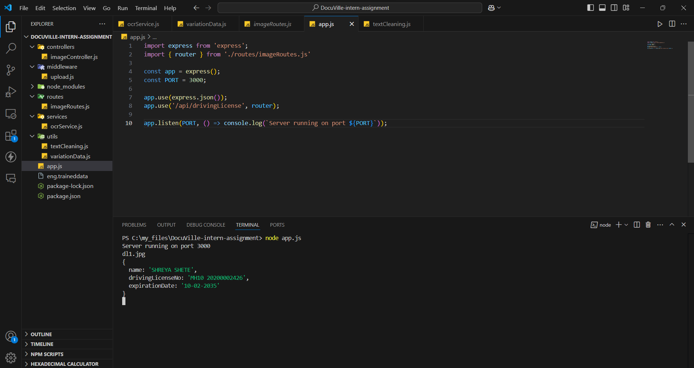
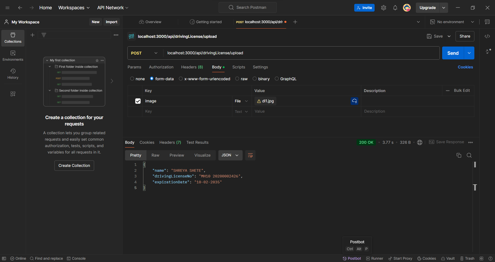

# DL_textExtractor
This api extracts 3 main fields from given image 

- to start the server on port 3000, execute
```bash
git clone https://github.com/PrathameshGandule/DL_textExtractor.git
```
```bash
cd DL_textExtractor
```
```bash
npm install
```
```bash
node app.js
```


- send a `POST` request to `localhost:3000/api/drivingLicense/upload`
- use POSTMAN client to upload the image through `form-data` in `body`
- upload only 1 image through variable named `image`
- use sample images taken from web provided in [`sampleImages`](./sampleImages) folder

- This tool is finetuned to extract text from Driving license from Maharashtra
- Make sure the only image of DL is there in your image and it should be clear



## Happy Coding !!!
